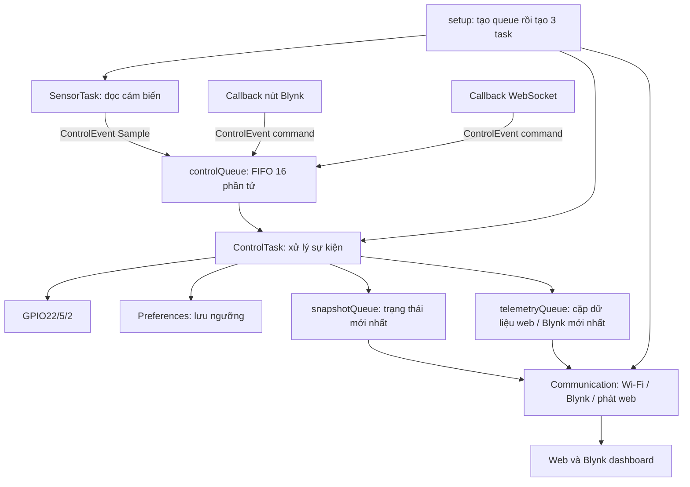

# Bước 4 — Hướng dẫn đọc toàn bộ phần RTOS của project

Bạn đã duyệt bước 4: tách phần giao tiếp thành task riêng và giải thích cách đọc. Bước này đã được build và kiểm thử trên máy tính; chưa nạp firmware hoặc kiểm thử trên ESP32 thật. Các link dưới đây trỏ tới file và dòng trong workspace hiện tại.

## 1. Bắt đầu bằng mục đích, rồi mới đọc API

Project đọc DHT11 và Sharp GP2Y10, so sánh với ngưỡng để điều khiển GPIO22/5/2, đồng thời cho người dùng xem số liệu và đặt ngưỡng qua web/Blynk. Arduino trên ESP32 vốn đã chạy trên FreeRTOS. Phần mới là tách công việc ứng dụng thành ba task do mình tạo.

Một **task** là một luồng thực thi có hàm chạy, stack và mức ưu tiên riêng. Scheduler của FreeRTOS quyết định task nào được chạy trên CPU. Khi một task chờ queue hoặc gọi `vTaskDelay`, task khác có cơ hội chạy. Những thao tác này không dừng toàn bộ ESP32.

Ba task ứng dụng được ghim vào core Arduino, hiện là core 1. Vì cùng một core, chúng được CPU luân phiên thực thi; không có nghĩa ba hàm cùng chạy tại một thời điểm trên core đó. ESP32 còn có task hệ thống, task mạng và `loopTask` của Arduino.

| Task | Công việc và dữ liệu sở hữu | Priority | Stack cấu hình |
| --- | --- | --- | --- |
| SensorTask | DHT, Sharp, mẫu đo vừa đọc | 1 | 4096 byte |
| ControlTask | Mode, ngưỡng, trạng thái output, ghi GPIO22/5/2, Preferences | 2 | 4096 byte |
| Communication | Giao tiếp Blynk, phát JSON web, lịch reconnect, dữ liệu chờ gửi | 1 | 8192 byte |

Priority 2 cao hơn 1. ControlTask có thể được scheduler ưu tiên khi có sự kiện cần xử lý. Đây chưa phải cam kết về độ trễ tối đa ngoài thực tế; phải đo trên board. Tổng stack cấu hình của ba task là 16 KiB, được cấp phát lúc chạy, chưa tính các task khác và queue.

## 2. Sơ đồ để giữ trong đầu khi đọc



Queue truyền **bản sao dữ liệu**. Phần điều khiển không gọi Blynk để chờ gửi mạng xong mới ghi output.

## 3. Điểm bắt đầu: main.cpp

Mở [setup()](../Code_Git/src/main.cpp#L10). Đọc theo thứ tự:

1. Khởi tạo Serial và cấu hình watchdog 15 giây.
2. `createAppQueues()` tạo các kênh truyền dữ liệu trước khi task/callback sử dụng.
3. `startControlTask()` tạo task điều khiển.
4. `startSensorTask()` tạo task cảm biến.
5. `startCommunicationTask()` tạo task giao tiếp.

Khác biệt quan trọng của bước 4: việc tạo SensorTask không còn nằm sau `Blynk.begin()` đang chờ mạng. Thiết bị có thể bắt đầu xử lý cảm biến/điều khiển ngay cả khi chưa kết nối được Wi-Fi hoặc Blynk.

`start...Task()` tạo task rồi trả về; nó không gọi trực tiếp hàm có vòng lặp vô tận để đợi hàm đó kết thúc. Scheduler có thể cho task mới chạy ngay trong quá trình `setup()` chưa hoàn tất, tùy trạng thái và priority. Thứ tự trên là thứ tự yêu cầu tạo task, không phải một hàng rào bắt mọi task khởi tạo xong lần lượt.

[loop()](../Code_Git/src/main.cpp#L21) chỉ ngủ 1000 ms mỗi vòng. Nó vẫn tồn tại theo framework Arduino. Ta không gọi thêm `vTaskStartScheduler()` vì framework đã khởi động scheduler.

## 4. Cách đọc một lệnh tạo task

Đọc [startControlTask()](../Code_Git/src/tasks/control/control_task.cpp#L78):

```cpp
xTaskCreatePinnedToCore(controlTask, "ControlTask", CONTROL_STACK_BYTES, nullptr,
                       2, &controlHandle, ARDUINO_RUNNING_CORE)
```

| Tham số | Ý nghĩa ở đây |
| --- | --- |
| `controlTask` | Hàm FreeRTOS sẽ chạy; xem thân hàm ở dòng 22 |
| `"ControlTask"` | Tên task dùng để nhận diện/debug |
| `CONTROL_STACK_BYTES` | Dung lượng stack 4096 byte theo API ESP32 này |
| `nullptr` | Không truyền dữ liệu đầu vào riêng cho task |
| `2` | Priority |
| `&controlHandle` | Địa chỉ biến nhận handle của task vừa tạo |
| `ARDUINO_RUNNING_CORE` | Core chạy task, hiện là 1 |

`controlHandle` là handle nhận diện task, không phải queue và không phải trạng thái output. `pdPASS` cho biết API tạo task thành công. Lần gọi tạo task thứ hai bị từ chối để tránh tạo hai task cùng sở hữu một phần cứng.

Trong thân hàm, phần **trước** `for (;;)` chỉ chạy một lần khi task bắt đầu. Phần **trong** vòng lặp chạy lặp lại. Biến cục bộ như `ControlState state` vẫn tồn tại qua các vòng lặp vì hàm task chưa kết thúc; stack riêng của task giữ nó.

## 5. Các kiểu dữ liệu: đọc app_types.h trước app_queues.cpp

Mở [ControlEvent](../Code_Git/src/shared/app_types.h#L48). `ControlEvent` là **kiểu struct**, còn trong `ControlEvent event;`, `event` mới là biến.

| Trường | Dùng để đọc sự kiện |
| --- | --- |
| `type` | Sample, ManualOutput, SetMode, SetThreshold hoặc GetThresholds |
| `source` | Web hoặc Blynk; có ý nghĩa khi xử lý lệnh/ngưỡng |
| `channel` | Temperature, Humidity hoặc Dust |
| `value` | Giá trị nút/mode/ngưỡng |
| `readings` | Bộ ba số đo của sự kiện Sample |
| `sampledAtMs` | Thời điểm lấy mẫu |

Không phải trường nào cũng được dùng cho mọi loại sự kiện. Sample dùng `readings` và timestamp; lệnh ngưỡng dùng `channel`, `value`, `source`. Không diễn giải `source` mặc định của Sample là cảm biến được đọc từ Blynk.

[ControlSnapshot](../Code_Git/src/shared/app_types.h#L57) là bản chụp trạng thái điều khiển: mode, thresholds, readings, outputs và revision. `outputRevision`/`thresholdRevision` là số phiên bản ứng dụng để nhận biết thay đổi hoặc yêu cầu phát lại; chúng không phải tick RTOS.

[TelemetryFrame](../Code_Git/src/shared/app_types.h#L66) chứa hai bộ số: `web` là mẫu thô và `blynk` là bộ số theo chính sách fallback cũ. Tách hai bộ giúp việc gửi mạng không sửa dữ liệu mà ControlTask đang sở hữu.

## 6. Ba queue ứng dụng hoạt động thế nào?

Đọc [createAppQueues()](../Code_Git/src/shared/app_queues.cpp#L14), rồi đọc các hàm ngay bên dưới.

| Queue | Sức chứa | Ghi | Đọc | Tác dụng |
| --- | --- | --- | --- | --- |
| controlQueue | 16 ControlEvent | `xQueueSend` | `xQueueReceive` | Các sample/lệnh được nhận theo thứ tự FIFO đã vào queue |
| snapshotQueue | 1 ControlSnapshot | `xQueueOverwrite` | `xQueuePeek` | Đọc trạng thái mới nhất, giữ lại trong queue |
| telemetryQueue | 1 TelemetryFrame | `xQueueOverwrite` | `xQueueReceive` | Lấy frame mới nhất rồi bỏ frame đó khỏi queue |

Ví dụ SensorTask có biến `event` trên stack. [postControlEvent()](../Code_Git/src/shared/app_queues.cpp#L27) đưa `&event` cho FreeRTOS để **copy `sizeof(ControlEvent)` byte vào queue**. Sau khi gửi thành công, SensorTask có thể tái sử dụng biến đó. ControlTask nhận một bản sao riêng qua [receiveControlEvent()](../Code_Git/src/shared/app_queues.cpp#L31).

`xQueueReceive(..., 100 ms)` nhận ngay nếu queue đã có dữ liệu. Chỉ khi queue trống nó mới chờ, tối đa 100 ms; khi có phần tử mới, task có thể thức sớm hơn. Trong thời gian chờ, nó không quay vòng chiếm CPU.

Callback gửi với thời gian chờ 0: nếu đầy thì từ chối và ghi log; callback web còn trả JSON lỗi. SensorTask được chờ tối đa 100 ms khi đầy, sau đó log mẫu bị bỏ. Priority của ControlTask không làm lệnh vượt lên trước sample đã có trong FIFO.

Hai queue một phần tử là “hộp thư mới nhất”: khi mạng chậm hoặc mất mạng, giá trị cũ có thể bị ghi đè. Chúng không phải bộ lưu lịch sử hay cam kết gửi đủ mọi mẫu.

Dòng [static_assert](../Code_Git/src/shared/app_queues.cpp#L10) kiểm tra lúc biên dịch rằng kiểu dữ liệu có thể copy bằng byte theo quy tắc C++. Nếu không đạt thì build lỗi với thông báo đã ghi. Nó không chạy mỗi lần gửi và không chiếm thời gian xử lý trên board. Tránh đặt `String`/đối tượng sở hữu bộ nhớ động trong các message này. Lưu ý: một con trỏ vẫn có thể là trivially copyable; phép kiểm tra không tự chứng minh dữ liệu mà con trỏ trỏ tới còn sống. Các struct hiện tại dùng giá trị trực tiếp để tránh vấn đề đó.

## 7. Luồng số 1: từ cảm biến đến output và màn hình

Mở [sensorTask()](../Code_Git/src/tasks/sensor/sensor_task.cpp#L17). Task tạo và sở hữu DHT/Sharp, đọc số đo trong vòng lặp, đặt `type = Sample`, ghi timestamp, rồi gửi queue.

Sau lần đọc, nó gọi `vTaskDelay(10 ms)`. Đây là khoảng nghỉ **sau khi công việc hoàn tất**, không có nghĩa chu kỳ lấy mẫu chính xác 10 ms. Sharp vẫn có waveform microsecond của driver; DHT có cache nội bộ khoảng 2 giây. Không thay các delay microsecond của driver bằng `vTaskDelay`.

Tiếp tục tại [vòng lặp ControlTask](../Code_Git/src/tasks/control/control_task.cpp#L41):

1. Nhận event.
2. Gọi `processControlEvent(state, event)` để tính trạng thái và tác động cần thực hiện.
3. Dựa trên `writeMask`, ghi các GPIO tương ứng.
4. Nếu có yêu cầu lưu ngưỡng thì ghi Preferences.
5. Nếu đến lịch telemetry thì phát TelemetryFrame; phát snapshot sau sự kiện hợp lệ.

Đọc nhánh [EventType::Sample](../Code_Git/src/tasks/control/control_state.cpp#L27), rồi [evaluateAuto()](../Code_Git/src/tasks/control/control_logic.cpp#L3). Quy tắc cũ là nhiệt độ **lớn hơn** ngưỡng, độ ẩm **nhỏ hơn** ngưỡng, bụi **lớn hơn** ngưỡng. Ví dụ mẫu hợp lệ `{36, 70, 110}` và ngưỡng `{35, 80, 100}` ở Auto yêu cầu bật cả ba output.

`processControlEvent` chỉ tính toán trên dữ liệu; nó không gọi GPIO, Wi-Fi hay Preferences. Kết quả `effects` mô tả việc cần làm. [writeOutputs()](../Code_Git/src/tasks/control/control_task.cpp#L16) mới thực hiện ghi phần cứng. Cách tách này cho phép test quy tắc trên PC.

Lịch telemetry 2 giây dựa trên timestamp của sample, không dựa trên lúc mạng gửi xong. Chính sách cũ được giữ: ở mẫu đến lịch gửi, nếu nhiệt độ/độ ẩm NaN hoặc bụi ngoài 0..1000 thì Blynk nhận bộ `{50,50,50}`, còn web giữ mẫu thô; Auto sử dụng bộ fallback ở lần đó. Sample tiếp theo lại cung cấp bộ thô. Việc sửa chính sách cảm biến lỗi là thay đổi riêng, chưa thuộc bước này.

## 8. Luồng số 2: bấm nút Blynk để điều khiển

Ví dụ bật V6:

1. [BLYNK_WRITE(V6)](../Code_Git/src/tasks/communication/network_connection.cpp#L74) được thư viện gọi khi nhận lệnh.
2. [submitBlynkCommand()](../Code_Git/src/tasks/communication/network_connection.cpp#L61) tạo event ManualOutput, channel Temperature, value 1.
3. Callback gửi queue rồi trả về, không ghi GPIO.
4. ControlTask nhận event; nhánh [ManualOutput](../Code_Git/src/tasks/control/control_state.cpp#L44) chuyển mode sang Manual và chọn output nhiệt độ.
5. ControlTask ghi GPIO22 theo writeMask, rồi phát snapshot.
6. Communication đọc snapshot để cập nhật Blynk.

V7/V8 tương tự cho độ ẩm/bụi. V9 = 1 chọn Auto, giá trị khác chọn Manual. Khi chuyển sang Auto, phép so sánh và ghi output xảy ra lúc xử lý sample tiếp theo. V10/V11/V12 đặt ngưỡng.

Các callback Blynk chạy trong ngữ cảnh gọi thư viện của CommunicationTask, kể cả lúc thư viện xử lý dữ liệu trong kết nối. Không gọi Blynk từ SensorTask hoặc ControlTask.

## 9. Luồng số 3: thay slider trên web

Đọc [updateSliderPWM()](../Code_Git/data/main.js#L53). Ví dụ slider nhiệt độ gửi chuỗi `1s40` qua WebSocket `/ws`.

Theo luồng [handleWebSocketRequest()](../Code_Git/src/tasks/communication/web_dashboard.cpp#L22) → [parseWebCommand()](../Code_Git/src/tasks/communication/web_command.cpp#L5) → `postControlEvent()` → [SetThreshold](../Code_Git/src/tasks/control/control_state.cpp#L67).

Parser kiểm tra frame, ký tự và tràn số nguyên trước khi tạo lệnh. ControlTask đổi ngưỡng RAM, lưu Preferences, tăng thresholdRevision rồi phát snapshot. Communication phát JSON `sensor1/sensor2/sensor3`; JavaScript nhận JSON và cập nhật slider. Lệnh `getValues` và lúc WebSocket kết nối yêu cầu phát lại ngưỡng bằng cách tăng revision.

Callback WebSocket do task của thư viện AsyncTCP gọi; không được giả định nó chạy trong CommunicationTask. Vì vậy callback chỉ parse dữ liệu cục bộ và gửi queue. Đối tượng JSON phát số liệu được tạo cục bộ trong hàm phát, không chia sẻ biến JSON với callback.

Phần `data/` vẫn là giao diện web, không chứa task RTOS. Task nằm trong firmware C++, còn JavaScript chạy trong trình duyệt.

## 10. Phần thêm ở bước 4: CommunicationTask

Mở [communicationTask()](../Code_Git/src/tasks/communication/communication_task.cpp#L14). Lúc bắt đầu nó đăng ký watchdog, khởi tạo mạng và server web. Sau đó đọc vòng lặp từ dòng 30 theo thứ tự:

1. Kiểm tra Wi-Fi; nếu mất kết nối thì yêu cầu kết nối theo lịch tối đa một lần mỗi 30 giây giữa các yêu cầu. Không có vòng `while` chờ Wi-Fi lên.
2. Khi Wi-Fi lên, thử Blynk theo lịch 5 giây tính từ khi lần thử trước kết thúc. Khi đang kết nối thì gọi `serviceCloudConnection()`.
3. Nhận biết thay đổi trạng thái mạng. Phiên cloud mới đánh dấu các giá trị hiện có cần gửi lại.
4. Luôn lấy telemetry mới nhất khỏi mailbox, kể cả offline, để giữ bộ số gần nhất.
5. Đọc snapshot, cập nhật dữ liệu chờ gửi cloud và phát ngưỡng web khi cần.
6. Khi cloud kết nối, gửi tối đa một virtual pin đã đến lượt.
7. Dọn WebSocket client, reset watchdog của chính task, nghỉ 10 ms rồi lặp lại.

`RetrySchedule` tại [communication_state.cpp](../Code_Git/src/tasks/communication/communication_state.cpp#L4) dùng phép trừ unsigned để tính thời gian đã qua, hoạt động qua lần `millis()` quay vòng đối với các khoảng chờ đang dùng. Nó là lớp C++ quản lý mốc thời gian, không phải software timer riêng của FreeRTOS.

| Tình huống | Hành vi dự kiến theo code và kiểm thử host |
| --- | --- |
| Khởi động không có router | Sensor/Control vẫn chạy; Communication thử lại Wi-Fi theo lịch |
| Có Wi-Fi LAN nhưng không tới Blynk | Web LAN vẫn có đường phục vụ; điều khiển tiếp tục; cloud thử lại |
| Mất hoàn toàn Wi-Fi | Web qua Wi-Fi không truy cập được; điều khiển cục bộ tiếp tục |
| Blynk kết nối lại | Gửi trạng thái board hiện tại; không gọi syncAll để lấy trạng thái cloud cũ ghi đè board |

### Dữ liệu chờ gửi: CloudOutbox

Đọc [stageSnapshot()](../Code_Git/src/tasks/communication/communication_state.cpp#L19), [newSession()](../Code_Git/src/tasks/communication/communication_state.cpp#L39), rồi `next()` và `sent()` phía dưới.

CloudOutbox có 13 ô tương ứng V0..V12. Một ô giữ giá trị mới nhất và cờ cần gửi. Nó là dữ liệu riêng của CommunicationTask, không phải một FreeRTOS queue dùng chung.

| Pin | Dữ liệu board phát |
| --- | --- |
| V0..V2 | Nhiệt độ, độ ẩm, bụi cho Blynk |
| V3..V5 | Trạng thái ba output |
| V6..V8 | Đồng bộ ba nút theo output thực tế |
| V9 | Mode hiện tại: 1 Auto, 0 Manual |
| V10..V12 | Ba ngưỡng hiện tại |

Trong bước 4, board phát cả mode V9 và cập nhật V6..V8 ở Manual để dashboard có thể khớp lại sau reconnect. Đây là thay đổi về đồng bộ giao diện; quy tắc ghi GPIO vẫn do ControlTask quyết định.

Nếu mất mạng và nhiệt độ lần lượt là 30, 31, 32, ô chờ gửi giữ 32. Khi gửi được, `sent()` mới xóa cờ pending. Nếu gửi thất bại thì đóng phiên, đợi retry; phiên mới đánh dấu lại các ô có dữ liệu. Khoảng cách giữa hai lần gửi pin thành công ít nhất 125 ms trong một phiên. 13 pin cần khoảng 1,5 giây từ lần đầu tới lần cuối nếu mạng và task được phục vụ đều; đây không phải hạn chót bảo đảm. Nhịp này không tính thông điệp đăng nhập/heartbeat của thư viện.

`publishCloudValue()` thành công chỉ có nghĩa transport còn kết nối sau lời gọi gửi, không phải dashboard đã xác nhận nhận được dữ liệu. Không bổ sung cơ chế lưu lịch sử/ACK riêng trong bước này.

## 11. Đọc phần mạng nâng cao sau khi hiểu task và queue

[network_connection.cpp](../Code_Git/src/tasks/communication/network_connection.cpp#L15) thay `Blynk.begin()` bằng `Blynk.config()` rồi thử kết nối có lịch. Wi-Fi/Blynk config cũ được chuyển nguyên giá trị sang `network_config.h`.

Chỉ đặt `Blynk.connect(750)` chưa tạo ra giới hạn cứng 750 ms cho cả lần gọi: bên trong còn phân giải DNS, TCP, đọc giao thức và khả năng thử port khác. Đã đối chiếu mã thư viện Blynk và Arduino-ESP32 2.0.17 trong môi trường build của project trước khi triển khai.

[AsyncDns::lookup()](../Code_Git/src/tasks/communication/async_dns.cpp#L36) gửi yêu cầu qua `tcpip_try_callback` để task TCP/IP gọi DNS. Nó trả về ngay khi chưa có kết quả; task giao tiếp tiếp tục vòng làm việc. Callback DNS đưa kết quả vào **queue nội bộ một phần tử** — queue này bổ sung cho ba queue ứng dụng ở mục 6.

Đối tượng request tồn tại suốt thời gian chạy. Nếu quá 2 giây vẫn chưa có kết quả, code chỉ ghi log một lần; không hủy/ghi đè request mà callback cũ còn tham chiếu. Đây là mốc quan sát, không phải bảo đảm DNS hoàn tất trong 2 giây. Khi mất Wi-Fi, generation tăng để bỏ kết quả thuộc phiên cũ. Kết quả IPv4 được cache 60 giây.

[BoundedWiFiClient](../Code_Git/src/tasks/communication/bounded_wifi_client.cpp#L5) là transport riêng cho Blynk: kết nối IP với timeout 750 ms mỗi lần TCP, đặt timeout đọc/socket 1 giây theo đơn vị của WiFiClient bản đang dùng, và gửi socket bằng `MSG_DONTWAIT`. Gửi lỗi hoặc chỉ gửi một phần thì đóng phiên để tránh vòng retry ghi dài; outbox gửi lại dữ liệu hiện tại ở phiên sau. Không sửa transport của web.

Các biện pháp này giảm những chỗ chờ dài đã xác định trong thư viện. Tổng thời gian `Blynk.connect/run` vẫn phụ thuộc xử lý giao thức, các lần gọi thấp hơn và lập lịch; không gọi đây là hệ thống hard real-time hay khẳng định mọi vòng Communication dưới 750 ms. Cần kiểm tra router/DNS/Blynk thật và watchdog trên board.

## 12. Watchdog, ownership và những điều dễ nhầm

Mỗi task ứng dụng gọi `esp_task_wdt_add(nullptr)` một lần và `esp_task_wdt_reset()` mỗi vòng. `nullptr` ở API này chỉ task đang gọi; reset watchdog là báo task còn tiến triển, không phải reset ESP32 mỗi vòng. Nếu thiếu tài nguyên, [requireTaskResource()](../Code_Git/src/shared/task_support.h#L6) ghi operation bị lỗi rồi abort.

Ứng dụng không thêm mutex cho state vì chỉ ControlTask sửa state/Preferences/output và các bên khác nhận bản sao qua queue. CloudOutbox chỉ CommunicationTask dùng; DHT/Sharp chỉ SensorTask dùng. FreeRTOS bảo vệ thao tác queue; các thư viện hệ thống vẫn có đồng bộ nội bộ của chúng. Nếu sau này task khác trực tiếp truy cập các đối tượng đang có một chủ sở hữu thì cần xem lại thiết kế đồng bộ.

ControlTask có `vTaskDelay(1)` sau mỗi lượt để nhường CPU cả khi queue luôn đầy. Số 1 ở đây là **tick**; còn `pdMS_TO_TICKS(10)` là chuyển 10 ms sang tick. Không tự suy ra mọi nền tảng đều có tick 1 ms; cấu hình ESP32 hiện tại dùng 1000 Hz.

## 13. Kiểm chứng đã thực hiện và giới hạn

- Build ESP32 thành công: static RAM 46.372 byte, app Flash 919.509 byte. Xem [kết quả build](validation.md). Đây không phải đo heap/stack còn dư lúc chạy.
- 50 trường hợp logic điều khiển ở O0/O2; state/parser/queue/task Sensor-Control ở O0/O2 đều đạt.
- So sánh 20.736 trường hợp với fixture bước 2 khớp giá trị cuối GPIO/mode/telemetry; không so sánh thời gian vật lý/thứ tự giao thức mạng.
- Test mã CommunicationTask với network/RTOS doubles: offline, retry, phục hồi, coalesce, pacing, gửi lỗi, đồng bộ lại, watchdog. Test startup dùng chính main.cpp và kiểm tra thứ tự tạo queue/task.
- Test mã AsyncDns/BoundedWiFiClient với doubles: DNS callback muộn, invalidate, cache, lỗi, đơn vị timeout, dispatch hàm virtual, gửi thiếu/lỗi. Các test mới chạy O0/O2. Xem [kết quả kiểm thử](validation.md).
- Hash các file src/data đã tồn tại trước bước 4: chỉ main.cpp thay đổi; driver, state/logic, pin và data giữ nguyên. Config/callback được kiểm tra khi tách file. Xem [kết quả đối chiếu](validation.md).

Test doubles không mô phỏng đầy đủ scheduler, radio, DNS server hay cloud thật. Chưa đo stack high-water mark, chưa flash board, chưa tuyên bố đã nghiệm thu phần cứng. Khác biệt NVS cũ vẫn còn: web lưu bụi với key `DoBui`, boot/Blynk dùng `Bui`; mode/output không được bổ sung persistence. Tài liệu ghi rõ để bạn không nhầm đây là hành vi mới của RTOS.

Bộ kiểm thử host và fixture đã được xóa theo yêu cầu người dùng. Các kết quả ở trên là ghi nhận lịch sử; repository hiện tại không còn cung cấp các lệnh chạy lại bộ test đó.

Tài liệu tham chiếu API: [Espressif FreeRTOS](https://docs.espressif.com/projects/esp-idf/en/v4.4.7/esp32/api-reference/system/freertos.html) giải thích task, queue và các khác biệt của bản ESP32; [Blynk connection management](https://docs.blynk.io/en/blynk-library-firmware-api/connection-management) mô tả config/connect/run. Với timeout và đơn vị cụ thể của build này, đối chiếu mã thư viện cục bộ đã nêu ở mục 11.

## 14. Cách tự học lần lượt và bước tiếp theo

Lượt đầu chỉ đọc mục 1–7 và mở các link: main → kiểu dữ liệu → queue → sensor → control. Tự lần theo một mẫu `{36,70,110}` ở Auto. Khi giải thích được ai gửi và ai ghi GPIO, đọc tiếp hai luồng lệnh ở mục 8–9. Lượt cuối mới đọc cơ chế offline/reconnect và phần transport ở mục 10–12.

Bạn đã hiểu phần cốt lõi khi trả lời được: `event` ở SensorTask có phải cùng biến với `event` ở ControlTask không; ai duy nhất ghi ba output; task nào ngủ khi queue trống; và tại sao mất Blynk không còn chặn việc tạo SensorTask.

Bước kế tiếp đề xuất sau khi bạn hiểu và duyệt: đo tài nguyên và kiểm thử trên ESP32 thật (boot offline, mất Wi-Fi, Wi-Fi có LAN nhưng mất Internet/DNS, Blynk phục hồi, web/Blynk đổi ngưỡng và Manual/Auto, theo dõi watchdog/queue/stack). Chưa thực hiện hoặc tự thêm mã đo của bước kế tiếp trong bước 4.
