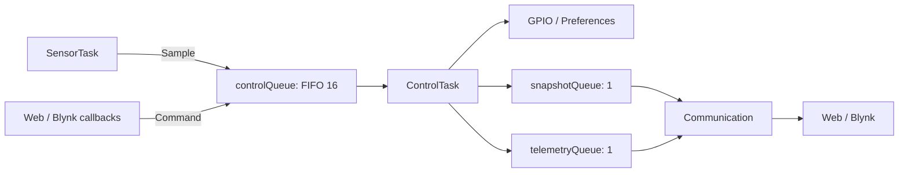

# Firmware Structure

The firmware consists of three application tasks: **Sensor**, **Control**, and **Communication**. The entry point is [main.cpp](main.cpp); browser assets are in [data/](../data/). See the [main README](../README.md) for an overview of the project features, technologies, and images.

## Modules

| Module | Main files | Responsibilities |
| --- | --- | --- |
| Startup | [main.cpp](main.cpp) | Initialize Serial at 9600 baud and a 15-second watchdog; create queues, then start Control → Sensor → Communication; delay the Arduino loop for 1 second |
| Data types | [app_types.h](shared/app_types.h) | Define readings, thresholds, modes, events, snapshots, and telemetry |
| Queues | [app_queues.cpp](shared/app_queues.cpp) | Create and access the three application queues |
| Resource checks | [task_support.h](shared/task_support.h) | Log `event=rtos_fatal operation=...` and abort when a resource check fails |
| Sensors | [sensor_task.cpp](tasks/sensor/sensor_task.cpp), [SharpGP2Y10.cpp](tasks/sensor/SharpGP2Y10.cpp) | Own the DHT/Sharp drivers, acquire samples, and submit events |
| Control hardware | [control_task.cpp](tasks/control/control_task.cpp) | Own application state, GPIO22/5/2, and Preferences; execute control effects |
| Control logic and state | [control_logic.cpp](tasks/control/control_logic.cpp), [control_state.cpp](tasks/control/control_state.cpp) | Apply Auto/Manual rules and events, prepare telemetry, and select NVS keys |
| Communication scheduling | [communication_task.cpp](tasks/communication/communication_task.cpp), [communication_state.cpp](tasks/communication/communication_state.cpp) | Schedule retries, read mailboxes, publish web data, and coalesce and send Blynk values |
| Wi-Fi/Blynk | [network_connection.cpp](tasks/communication/network_connection.cpp) | Establish connections and convert V6–V12 callbacks into events |
| DNS/transport | [async_dns.cpp](tasks/communication/async_dns.cpp), [bounded_wifi_client.cpp](tasks/communication/bounded_wifi_client.cpp) | Resolve DNS through the TCP/IP task and limit individual Blynk socket operations |
| Web | [web_dashboard.cpp](tasks/communication/web_dashboard.cpp), [web_command.cpp](tasks/communication/web_command.cpp) | Serve HTTP/SPIFFS assets, process WebSocket commands, and publish JSON |
| Configuration | [network_config.example.h](tasks/communication/network_config.example.h) | Provide a template for the Wi-Fi/Blynk settings in `network_config.h` |

Modules have corresponding headers that declare their APIs. Internal include paths are relative to `src`, for example `#include "shared/app_queues.h"`. Each file in a task directory does not represent a separate task.

## Tasks and Resource Ownership

| Task | Priority | Configured stack | Owned resources |
| --- | --- | --- | --- |
| SensorTask | 1 | 4096 bytes | DHT/Sharp drivers and the sample being acquired |
| ControlTask | 2 | 4096 bytes | ControlState, Preferences, and the three outputs |
| Communication | 1 | 8192 bytes | Wi-Fi/Blynk runtime, CloudOutbox, and pending publications |

All three tasks use `ARDUINO_RUNNING_CORE` and register with and reset their own watchdog subscriptions. WebSocket callbacks run in the AsyncTCP library context; they parse and submit events without modifying application state or GPIO outputs. Blynk callbacks run in the context of Communication's library calls.

## Data Flow



- `ControlEvent`: a copied sample or a ManualOutput, SetMode, SetThreshold, or GetThresholds command.
- `ControlSnapshot`: mode, thresholds, readings, outputs, and revisions; overwritten with the latest state and read using `xQueuePeek`.
- `TelemetryFrame`: raw readings for the web and readings subject to fallback for Blynk; overwritten with the latest frame and retrieved using `xQueueReceive`.
- Callbacks submit events without waiting; a full queue causes rejection and a log entry. Sensor waits up to 100 ms, then logs a dropped sample if the queue is still full.
- Mailboxes retain the latest data and do not guarantee delivery of every sample. DNS has an additional, separate single-slot result queue.

## Control and Threshold Persistence

`processControlEvent()` computes `ControlEffects`; `control_task.cpp` performs the GPIO/NVS writes. Auto enables the corresponding output when temperature > threshold, humidity < threshold, or dust > threshold. A manual output command changes one output, switches the entire system to Manual, and preserves the other outputs. Selecting Auto takes effect when the next sample is processed.

Preferences uses the `Gia tri nguong` namespace. Startup reads `NhietDo`, `DoAm`, and `Bui`, with defaults of 35/80/100. Web dust updates write `DoBui` instead; this inconsistency remains in the source. Mode and output states are not persisted. If an NVS write fails, the threshold remains applied in RAM and the error is logged.

Telemetry is generated approximately every 2000 ms based on sample timestamps. At that point, a NaN temperature/humidity reading or dust outside 0–1000 replaces the Blynk readings and Auto input with `{50,50,50}`; the web receives the raw readings. Between telemetry updates, Auto uses the newly received sample. The sentinel check skips Auto only when all three readings equal `-999`.

## Web Protocol

HTTP on port 80 serves `index.html` and static files from SPIFFS. WebSocket `/ws` accepts complete text frames:

| Command | Meaning |
| --- | --- |
| `getValues` | Republish thresholds |
| `1s35` | Set the temperature threshold to 35 |
| `2s80` | Set the humidity threshold to 80 |
| `3s100` | Set the dust threshold to 100 |

The parser accepts signed integers within the ESP32 int range; it does not enforce the HTML slider limits. JSON broadcasts to all clients use two formats:

```json
{"temperature": 30, "humidity": 70, "dust": 1.2}
```

```json
{"sensor1": "35", "sensor2": "80", "sensor3": "100"}
```

Invalid commands/frames receive `{"error":"invalid_command"}`; a full queue returns `{"error":"command_queue_full"}`. The JavaScript client does not currently display these errors. `getValues` does not return mode or output states. HTTP/WebSocket authentication is not implemented.

## Cloud Communication

`RetrySchedule` uses a 30-second Wi-Fi retry interval and a 5-second cloud retry interval. `CloudOutbox` retains the latest value for each pin V0–V12, spacing successful writes at least 125 ms apart within a session. A new session resends the current local state. Transport success is not an acknowledgement from the dashboard.

`AsyncDns` keeps requests alive for late callbacks, caches IPv4 results for 60 seconds, and uses generation tracking to discard obsolete results. The 2-second mark only triggers a pending-request log. `BoundedWiFiClient` sets a 750 ms TCP connection timeout and a 1-second socket timeout, writes using `MSG_DONTWAIT`, and closes the session on partial or failed writes. These limits do not impose a hard deadline on total Blynk processing time.

## Reading Order and Edit Locations

1. `main.cpp` → `shared/app_types.h` → `shared/app_queues.cpp`: startup and messages.
2. `sensor_task.cpp` → `control_state.cpp` → `control_logic.cpp` → `control_task.cpp`: trace a sample through to GPIO outputs.
3. `web_command.cpp` / `network_connection.cpp`: trace user commands to Control.
4. `communication_task.cpp` → `communication_state.cpp` → DNS/transport: data publication and reconnection.

Change sensor pins in `sensor_task.cpp` and output pins in `control_task.cpp`; change control rules in `control_logic.cpp`/`control_state.cpp`. Web protocol changes must remain consistent across [main.js](../data/main.js), the parser, and firmware JSON publications. Keep Blynk pin mappings consistent between callbacks and CloudOutbox.

Build from the repository root containing [platformio.ini](../platformio.ini): `pio run -e esp32doit-devkit-v1`. The host test suite is no longer included in the repository; hardware validation of the RTOS version remains incomplete.
