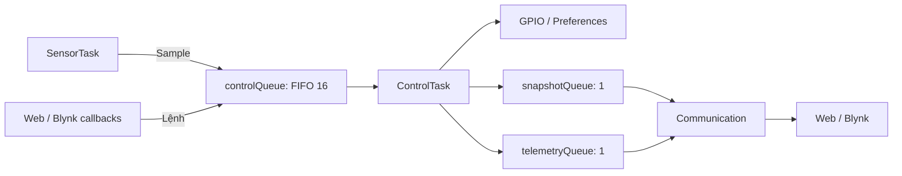

# Cấu trúc firmware

Firmware gồm ba task ứng dụng: **Sensor**, **Control**, **Communication**. Điểm vào là [main.cpp](main.cpp); giao diện trình duyệt ở [data/](../data/). Xem [README chính](../README.md) để cấu hình, build, nạp SPIFFS và thiết lập Blynk.

## Các module

| Module | File chính | Trách nhiệm |
| --- | --- | --- |
| Khởi động | [main.cpp](main.cpp) | Serial 9600, watchdog 15 giây, tạo queue rồi Control → Sensor → Communication; loop nghỉ 1 giây |
| Kiểu dữ liệu | [app_types.h](shared/app_types.h) | Số đo, ngưỡng, mode, sự kiện, snapshot và telemetry |
| Queue | [app_queues.cpp](shared/app_queues.cpp) | Tạo và truy cập ba queue ứng dụng |
| Lỗi tài nguyên | [task_support.h](shared/task_support.h) | Log `event=rtos_fatal operation=...` rồi abort khi kiểm tra thất bại |
| Cảm biến | [sensor_task.cpp](tasks/sensor/sensor_task.cpp), [SharpGP2Y10.cpp](tasks/sensor/SharpGP2Y10.cpp) | Sở hữu DHT/Sharp, đọc mẫu và gửi sự kiện |
| Phần cứng điều khiển | [control_task.cpp](tasks/control/control_task.cpp) | Sở hữu state, GPIO22/5/2 và Preferences; thực thi tác động |
| Quy tắc/trạng thái | [control_logic.cpp](tasks/control/control_logic.cpp), [control_state.cpp](tasks/control/control_state.cpp) | Auto/Manual, áp dụng sự kiện, chuẩn bị telemetry và chọn khóa NVS |
| Điều phối giao tiếp | [communication_task.cpp](tasks/communication/communication_task.cpp), [communication_state.cpp](tasks/communication/communication_state.cpp) | Retry, đọc mailbox, phát web, gom và gửi Blynk |
| Wi-Fi/Blynk | [network_connection.cpp](tasks/communication/network_connection.cpp) | Kết nối và chuyển callback V6–V12 thành sự kiện |
| DNS/transport | [async_dns.cpp](tasks/communication/async_dns.cpp), [bounded_wifi_client.cpp](tasks/communication/bounded_wifi_client.cpp) | DNS qua task TCP/IP; giới hạn thao tác socket Blynk |
| Web | [web_dashboard.cpp](tasks/communication/web_dashboard.cpp), [web_command.cpp](tasks/communication/web_command.cpp) | HTTP/SPIFFS, WebSocket, parse lệnh và JSON |
| Cấu hình | [network_config.example.h](tasks/communication/network_config.example.h) | Mẫu cho `network_config.h` chứa Wi-Fi/Blynk |

Các module có header cùng tên để khai báo API. Include nội bộ tính từ `src`, ví dụ `#include "shared/app_queues.h"`. Mỗi file trong thư mục task không tạo một task riêng.

## Task và quyền sở hữu

| Task | Priority | Stack cấu hình | Tài nguyên sở hữu |
| --- | --- | --- | --- |
| SensorTask | 1 | 4096 byte | Driver DHT/Sharp, mẫu đang đọc |
| ControlTask | 2 | 4096 byte | ControlState, Preferences, ba ngõ ra |
| Communication | 1 | 8192 byte | Wi-Fi/Blynk runtime, CloudOutbox, dữ liệu chờ phát |

Cả ba dùng `ARDUINO_RUNNING_CORE`, tự đăng ký/reset watchdog. Callback WebSocket chạy trong ngữ cảnh thư viện AsyncTCP; chỉ parse và gửi sự kiện, không sửa state/GPIO. Callback Blynk chạy trong ngữ cảnh gọi thư viện của Communication.

## Luồng dữ liệu



- `ControlEvent`: bản sao mẫu hoặc lệnh ManualOutput, SetMode, SetThreshold, GetThresholds.
- `ControlSnapshot`: mode, ngưỡng, số đo, ngõ ra, revision; ghi đè và đọc bằng `xQueuePeek`.
- `TelemetryFrame`: bộ thô cho web và bộ fallback cho Blynk; ghi đè và lấy bằng `xQueueReceive`.
- Callback gửi queue không chờ; khi đầy thì từ chối và log. Sensor chờ tối đa 100 ms rồi log mẫu bị bỏ nếu vẫn đầy.
- Mailbox giữ dữ liệu mới nhất, không bảo đảm gửi đủ mọi mẫu. DNS có thêm queue kết quả một phần tử riêng.

## Điều khiển và lưu ngưỡng

`processControlEvent()` tính `ControlEffects`; `control_task.cpp` mới ghi GPIO/NVS. Auto bật khi nhiệt độ > ngưỡng, độ ẩm < ngưỡng, bụi > ngưỡng. Manual đổi một ngõ ra, chuyển mode toàn hệ thống sang Manual và giữ các ngõ ra còn lại. Chọn Auto áp dụng khi xử lý mẫu tiếp theo.

Preferences dùng namespace `Gia tri nguong`. Boot đọc `NhietDo`, `DoAm`, `Bui`, mặc định 35/80/100. Web đặt bụi lại ghi `DoBui`; điểm không thống nhất này còn trong source. Không lưu mode/ngõ ra. Ghi NVS thất bại vẫn giữ ngưỡng RAM và log lỗi.

Telemetry tạo mỗi khoảng 2000 ms theo timestamp mẫu. Ở lần đó, NaN nhiệt độ/độ ẩm hoặc bụi ngoài 0–1000 làm bộ Blynk và đầu vào Auto thành `{50,50,50}`; web lấy bộ thô. Ngoài lịch telemetry, Auto dùng mẫu vừa nhận. Kiểm tra sentinel chỉ bỏ qua Auto khi cả ba giá trị bằng `-999`.

## Giao thức web

HTTP cổng 80 phục vụ `index.html` và file tĩnh từ SPIFFS. WebSocket `/ws` nhận frame text hoàn chỉnh:

| Lệnh | Ý nghĩa |
| --- | --- |
| `getValues` | Phát lại ngưỡng |
| `1s35` | Đặt ngưỡng nhiệt độ 35 |
| `2s80` | Đặt ngưỡng độ ẩm 80 |
| `3s100` | Đặt ngưỡng bụi 100 |

Parser nhận số nguyên có dấu trong phạm vi int ESP32, không áp giới hạn slider HTML. JSON phát tới mọi client có hai dạng:

```json
{"temperature": 30, "humidity": 70, "dust": 1.2}
```

```json
{"sensor1": "35", "sensor2": "80", "sensor3": "100"}
```

Lệnh/frame sai nhận `{"error":"invalid_command"}`; queue đầy nhận `{"error":"command_queue_full"}`. JavaScript chưa hiển thị các lỗi này. `getValues` không trả mode/ngõ ra. HTTP/WebSocket chưa có xác thực.

## Giao tiếp cloud

`RetrySchedule` đặt nhịp Wi-Fi 30 giây và cloud 5 giây. `CloudOutbox` giữ giá trị mới nhất cho mỗi pin V0–V12; gửi cách nhau ít nhất 125 ms trong một phiên. Phiên mới gửi lại trạng thái cục bộ. Thành công ở transport không phải ACK từ dashboard.

`AsyncDns` giữ request cho callback muộn, cache IPv4 60 giây và dùng generation bỏ kết quả cũ. Mốc 2 giây chỉ ghi log chờ. `BoundedWiFiClient` đặt TCP connect 750 ms, timeout socket 1 giây, gửi bằng `MSG_DONTWAIT`, đóng phiên khi ghi thiếu/lỗi. Đây không phải giới hạn cứng cho tổng thời gian xử lý Blynk.

## Thứ tự đọc và vị trí chỉnh sửa

1. `main.cpp` → `shared/app_types.h` → `shared/app_queues.cpp`: khởi động và thông điệp.
2. `sensor_task.cpp` → `control_state.cpp` → `control_logic.cpp` → `control_task.cpp`: mẫu đến GPIO.
3. `web_command.cpp` / `network_connection.cpp`: lệnh người dùng đến Control.
4. `communication_task.cpp` → `communication_state.cpp` → DNS/transport: phát dữ liệu và reconnect.

Đổi chân cảm biến ở `sensor_task.cpp`, chân ngõ ra ở `control_task.cpp`; đổi quy tắc ở `control_logic.cpp`/`control_state.cpp`. Đổi giao thức web phải đối chiếu [main.js](../data/main.js), parser và JSON firmware. Bảng Blynk cần đồng bộ giữa callback và CloudOutbox.

Build tại thư mục gốc: `pio run -e esp32doit-devkit-v1`. Xem [hướng dẫn RTOS](../docs/rtos-guide.md) và [kiểm thử lịch sử](../docs/validation.md). Bộ test host không còn trong repo; kiểm chứng phần cứng bản RTOS chưa hoàn tất.
